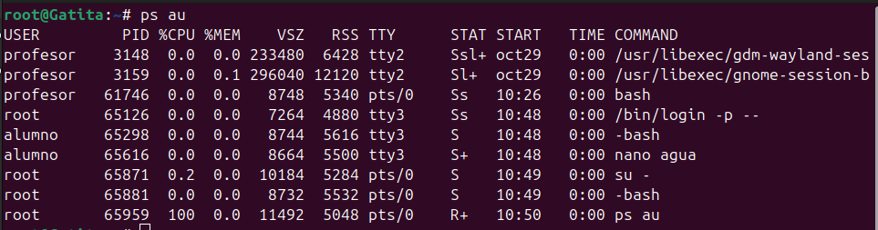
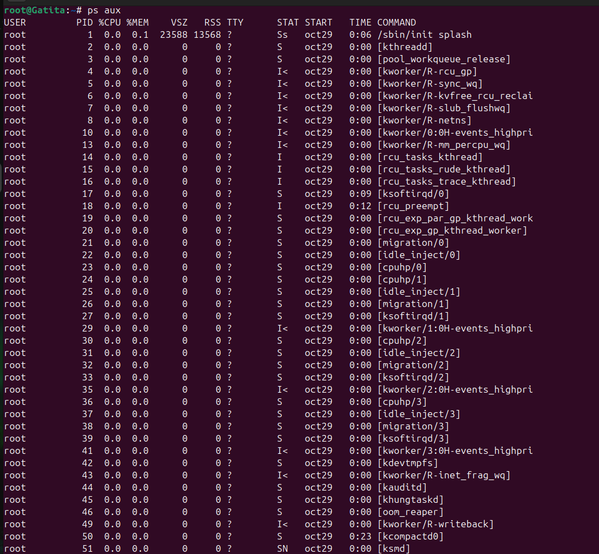
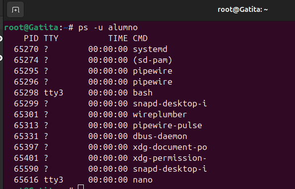
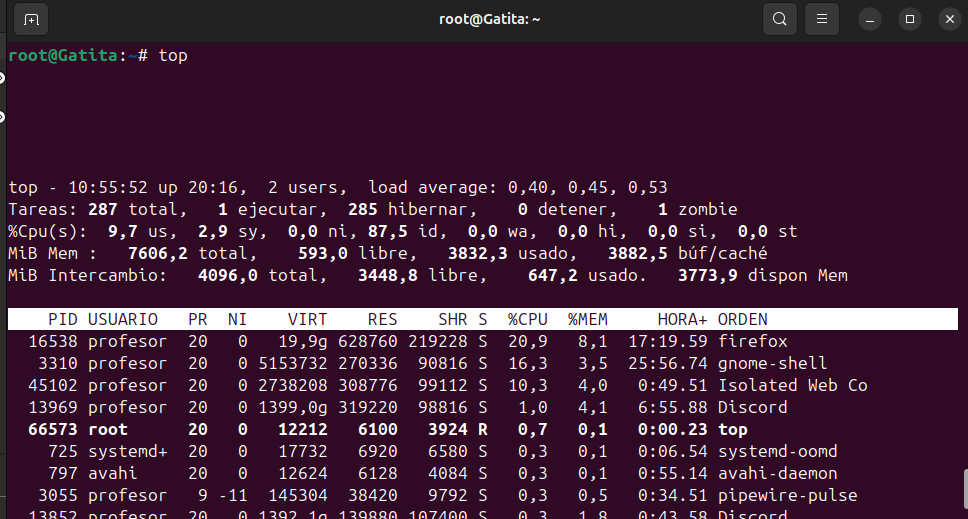
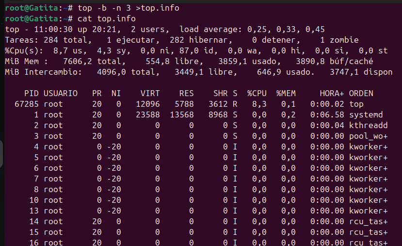
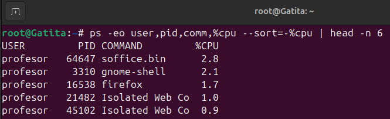

🧠 Comandos de Monitorización de Procesos en Linux
# Procesos

🧭 Introducción

Estos comandos permiten ver y controlar los procesos activos en Linux, ayudando a conocer el uso de CPU, memoria y usuarios que los ejecutan. Son esenciales para monitorizar el sistema.
---

## 📋 1. `ps au`
Muestra los **procesos activos** del usuario actual en un formato más detallado (sin procesos de otros usuarios).  
🔍 Es útil para ver qué programas están ejecutándose en tu sesión.  

📸 **Captura:**  

---

## 👥 2. `ps aux`
Lista **todos los procesos del sistema** incluyendo los de otros usuarios.  
🧩 Ideal para administradores que necesitan una visión completa del sistema.  

📸 **Captura:**  

---

## 👩‍💻 3. `ps -u alumno`
Muestra solo los procesos que pertenecen al usuario **alumno**.  
🎯 Muy útil para filtrar procesos por usuario específico.  

📸 **Captura:**  

---

## ⚡ 4. `top`
Muestra en **tiempo real** los procesos activos, el uso de CPU, memoria y carga del sistema.  
📊 Es una de las herramientas más comunes para **monitorizar el rendimiento**.  

📸 **Captura:**   

---

## 🧾 5. `top -b -n 3 > top.info`
Ejecuta `top` en **modo batch** (sin interfaz interactiva) y guarda **3 iteraciones** en el archivo `top.info`  
💾 Ideal para registrar la actividad del sistema y analizarla más tarde.  

📸 **Captura:**   

---

## 🖥️ 6. `htop`
Versión mejorada e interactiva de `top`, con una **interfaz más visual y colorida**.  
🎨 Permite navegar, ordenar y finalizar procesos fácilmente con el teclado.  

📸 **Captura:**  

---

## 🔝 7. `ps -eo user,pid,comm,%cpu --sort=-%cpu | head -n 6`
Muestra los **5 procesos que más CPU consumen**, ordenados de mayor a menor.  
🔥 Muy útil para detectar procesos que están sobrecargando el sistema.  

📸 **Captura:** 

