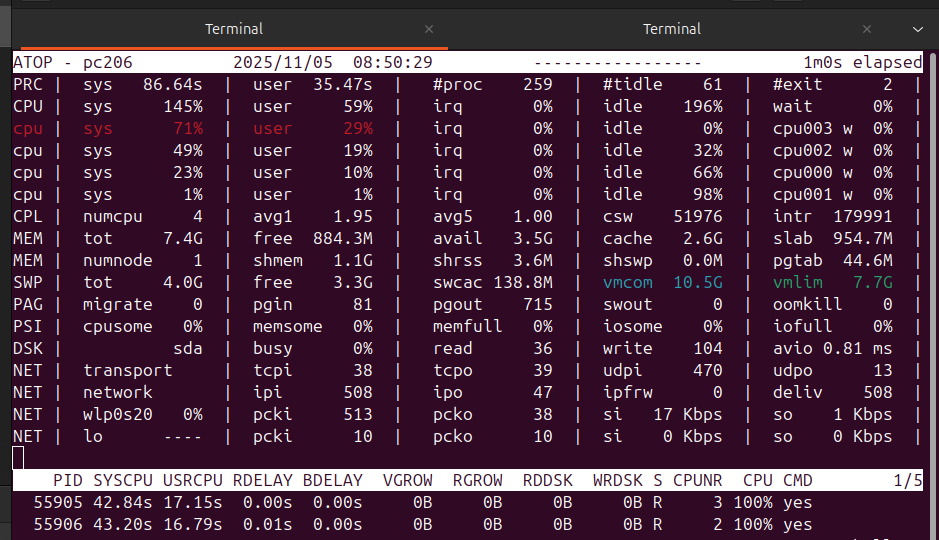
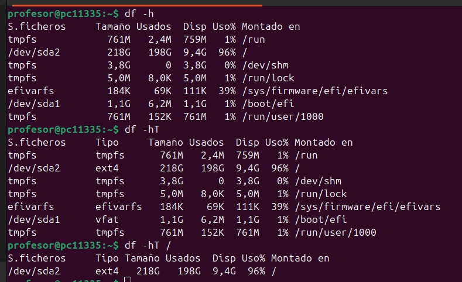
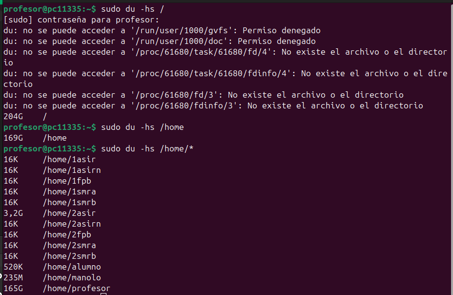
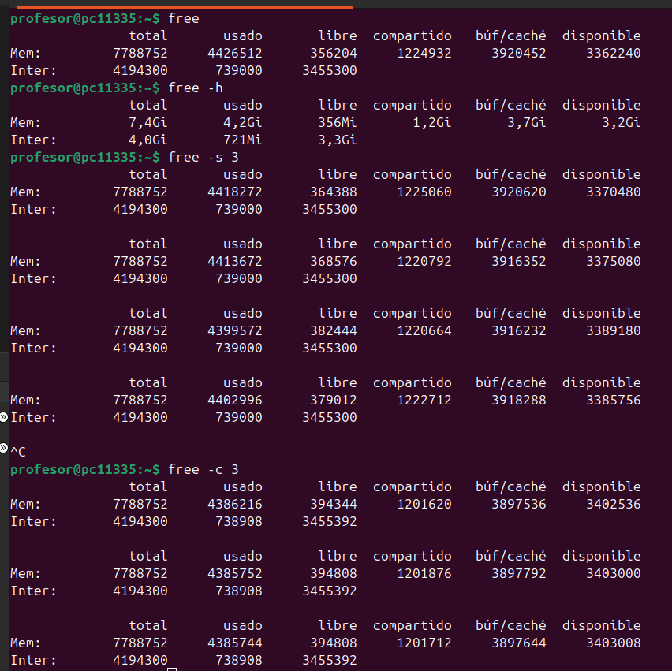
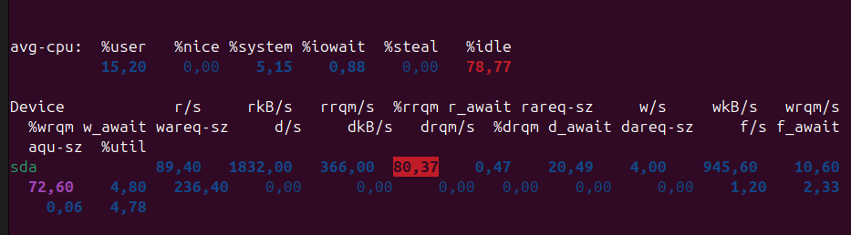

🧠 Comandos de Monitorización de Recursos en Linux
# Memoria, espacio y rendimiento del disco.

🧭 Introducción

Estos comandos permiten conocer el uso de recursos del sistema como CPU, memoria, disco y rendimiento general. Son muy útiles para la administración y diagnóstico del sistema Linux.

📋 1. atop

Muestra información detallada sobre procesos, uso de CPU, memoria, disco, red y más en tiempo real.
🔍 Es una herramienta avanzada de monitorización, similar a top pero con datos más completos y registro histórico.

📸 Captura:  

---

📋 2. df

Muestra el espacio en disco disponible y usado en cada sistema de archivos montado.
🔍 Es ideal para comprobar cuánto espacio queda en las particiones o unidades montadas.

📸 Captura:  

---

📋 3. du

Informa sobre el uso de espacio en disco por archivos y directorios.
🔍 Se usa frecuentemente con opciones como -h para mostrar tamaños en formato legible (KB, MB, GB).

📸 Captura:  

---

📋 4. free

Muestra la memoria RAM y swap disponible y utilizada del sistema.
🔍 Ayuda a analizar el consumo de memoria y detectar si el sistema necesita más recursos.

📸 Captura:  

---

📋 5. iostat

Permite ver estadísticas de entrada/salida de dispositivos, CPU y almacenamiento.
🔍 Es muy útil para detectar cuellos de botella en discos o rendimiento de CPU.

📸 Captura:  

