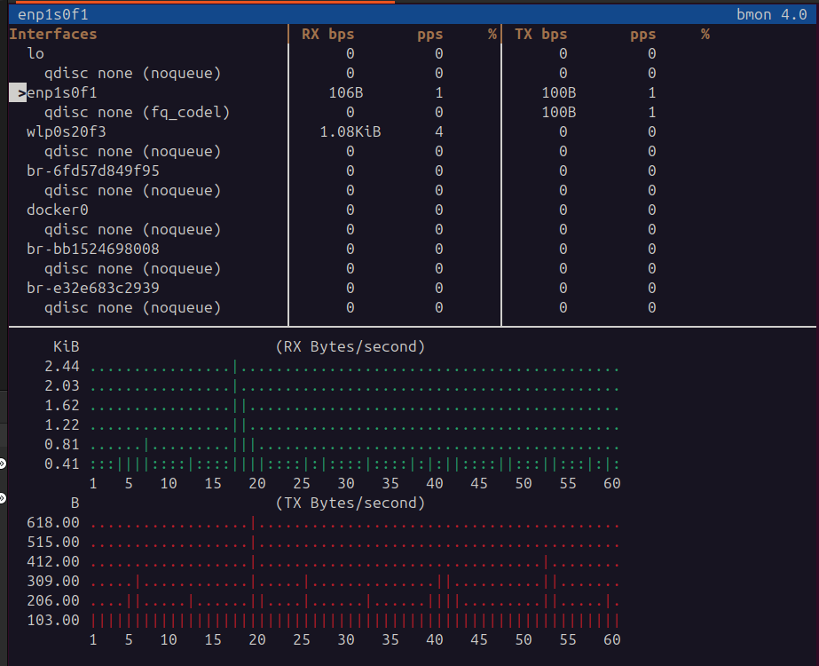
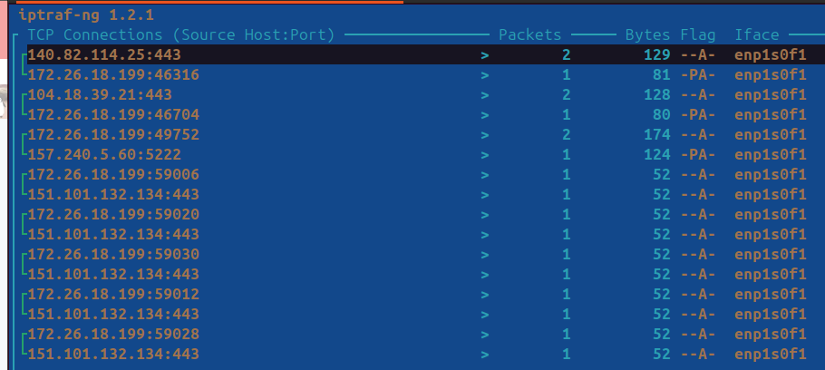
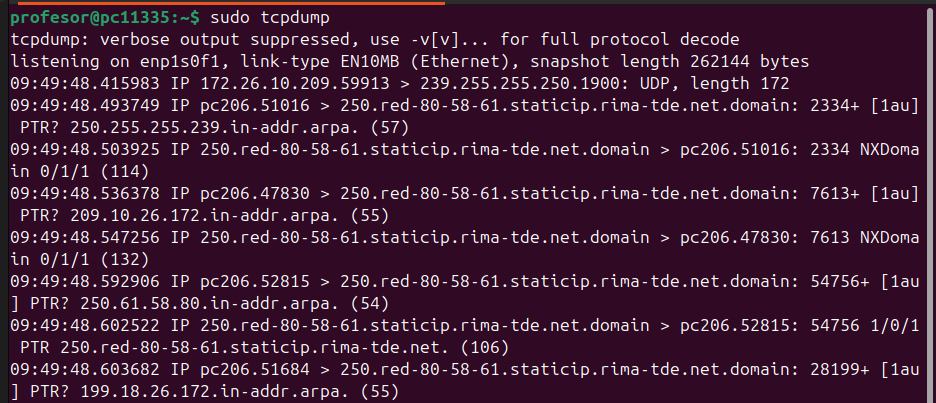
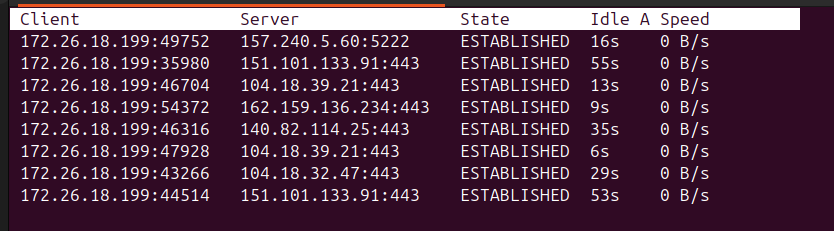

🧠 Comandos de Monitorización de Tráfico de Red en Linux
# Tráfico de la red.

🧭 Introducción

**Estos comandos permiten analizar y monitorizar el tráfico de red en tiempo real, ver la actividad de las interfaces, analizar paquetes, detectar cuellos de botella y diagnosticar problemas de conectividad. Son herramientas esenciales para diagnosticar problemas de conectividad, comprobar velocidades de transferencia y vigilar conexiones activas en Linux 🐧**

# 📋 1. `bmon`

Muestra el uso de **ancho de banda** en tiempo real por cada interfaz de red.  

🔍 Opciones principales:
q: salir del programa.
d: cambiar de vista (por ejemplo, resumen o estadísticas detalladas).
c: ver los gráficos de tráfico por interfaz.

💡 Uso práctico:
Ideal para detectar picos de tráfico, comprobar si una interfaz está transmitiendo datos o cuánto ancho de banda consume cada conexión.

📸 Captura:

---

# 📋 2. `iptraf`

Herramienta interactiva en modo texto para **monitorizar conexiones, tráfico por interfaz y estadísticas de red.**  
🔍 Permite observar la actividad en tiempo real de interfaces y puertos, mostrando bytes, paquetes y dirección origen/destino.

🧩 Características destacadas:
Permite ver tráfico TCP, UDP, ICMP y otros protocolos.
Muestra IPs origen y destino, puertos, número de paquetes y bytes transmitidos.
Se actualiza en tiempo real.

🔧 Opciones al iniciar:

sudo iptraf → Abre el menú principal.

Dentro de la interfaz puedes elegir:

“IP traffic monitor”: para ver conexiones por interfaz.

“Detailed interface statistics”: para ver tráfico por protocolo.

📊 Uso práctico:
Perfecto para analizar qué equipos o servicios generan más tráfico en tu red local.
📸 Captura:

---

# 📋 3. `tcpdump`

Analiza y captura **paquetes** que circulan por la red.  
🔍 Es ideal para diagnosticar problemas de red, verificar tráfico sospechoso o analizar protocolos.  
Se usa con permisos de superusuario y admite filtros potentes (por IP, puerto, protocolo, etc.).

📸 Captura:

---

# 📋 4. `tcptrack`

Muestra las **conexiones TCP activas** en tiempo real junto con su velocidad de transferencia.  
🔍 Es muy útil para observar qué IPs están conectadas y cuántos datos están enviando o recibiendo.  

📸 Captura:

## [Unidad 4. Puertos](../ud4/ud4.md)
