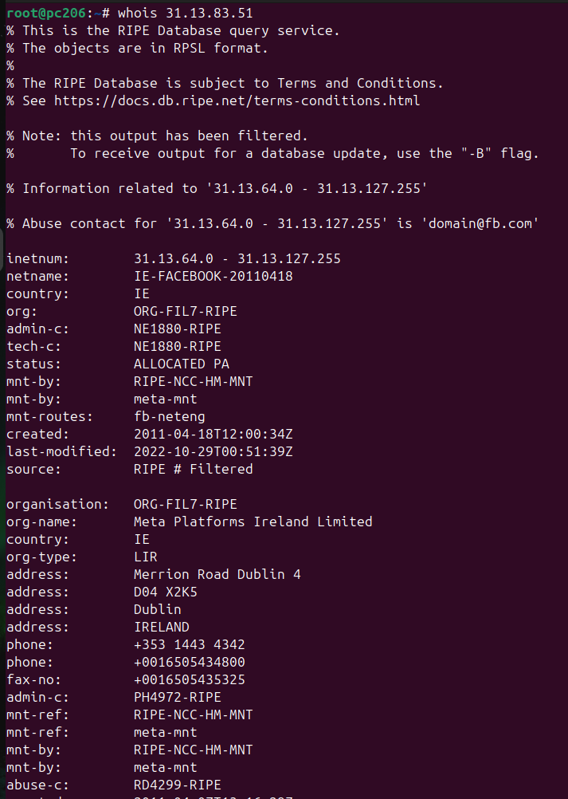

🧠 Comandos de Monitorización de Puertos en Linux
# 📡 Conexiones, puertos abiertos y resolución ARP

🧭 Introducción

**Estos comandos permiten ver los puertos y conexiones activas, así como identificar equipos conectados en la red mediante tablas ARP o escaneos de puertos. Son muy útiles para la administración, auditoría y diagnóstico de redes.**

## Lista de comandos:

🔗 [arp -a](#-1-arp--a)

🔗 [arp -n](#-2-arp--n)

🔗 [nmap](#-3-nmap)

🔗 [ss -ntnp](#-4-ss--ntnp)

🔗 [ss -plunt](#-5-ss--plunt)

🔗 [whois](#-6-whois)

---

## 📋 1. `arp -a`

Muestra la **tabla ARP del sistema**, indicando las direcciones IP y MAC de los equipos conectados la interfaz por la que se ha detectado y el nombre del host (si es resolvible).    
🔍 Es útil para saber:
* Qué dispositivos están conectados a tu red local 🖥️📱.  
* Comprobar si un dispositivo responde.    
* Detectar equipos desconocidos o posibles intrusos.  

🔍 Opciones:  
-a → intenta resolver nombres de host mediante DNS (puede tardar más).

📸 Captura:

[⬆️ Volver a la lista de comandos](#lista-de-comandos)

---

## 📋 2. `arp -n`

Muestra la misma tabla ARP, pero **sin resolver los nombres de host**, es decir, mostrando directamente las IPs y direcciones MAC.  

🔍 Ventajas:
-n →   
* Más rápido ⚡  
* No usa DNS  
* Evita retrasos si el host no tiene nombre asociado  
* Preferido para scripts y auditorías
  
📸 Captura:

[⬆️ Volver a la lista de comandos](#lista-de-comandos)

---

# 📋 3. `nmap`

Escanea los puertos abiertos de un equipo o red.  
🔍 Es una herramienta muy potente para auditar la seguridad, verificar servicios activos o comprobar el estado de un servidor.  
*Ejemplo:*
`sudo nmap -sS 192.168.1.0/24`

🔍 Opciones:  
--top-ports 100 → Escanea los 100 puertos más usados según estadísticas de Nmap.  
sV → Activa la detección de versiones. 🔸 Identifica qué servicio corre en cada puerto (ej. Apache 2.4, OpenSSH 8.x…).  
ip → Dirección del objetivo (equipo, servidor o rango).

📸 Captura:

[⬆️ Volver a la lista de comandos](#lista-de-comandos)

---

# 📋 4. `ss -ntnp`

Muestra las conexiones TCP en escucha (LISTEN) con sus puertos, PID y procesos asociados.  
⚡ Es el reemplazo moderno de netstat, más rápido y preciso.

🔍 Opciones:  
-n → Muestra direcciones y puertos sin resolver nombres.  
-t → Filtra para mostrar únicamente conexiones TCP.  
-n (segunda vez) → Repetir esta opción no afecta, simplemente reafirma el modo “no-resolver”.  
-p → Muestra el PID y el nombre del proceso que usa cada socket.

📸 Captura:

[⬆️ Volver a la lista de comandos](#lista-de-comandos)

---

# 📋 5. `ss -plunt`

Muestra todas las conexiones TCP y UDP, tanto en escucha como activas.  
🔍 Muy útil para obtener una visión completa de la actividad de red del sistema.

🔍 Opciones:  
-p → Muestra el PID y nombre del proceso que usa cada socket.  
-l → Filtra para mostrar solo puertos en escucha (LISTEN).  
-u → Incluye sockets UDP. 🔸 Muestra servicios como DNS, DHCP, NTP, etc.  
-n → Evita resolver nombres de dominio y servicios.  
-t → Incluye sockets TCP.

📸 Captura:

[⬆️ Volver a la lista de comandos](#lista-de-comandos)

---

# 🌎 6. `whois`
Herramienta de red que permite **obtener información sobre un dominio o una dirección IP** (propietario, fecha de registro, servidores DNS, etc.). 🕵️‍♂️

🔍 Uso:
whois [dominio.com] → Muestra la información de ese dominio.
whois [IP] → Muestra a quién pertenece esa dirección IP.

💡 Muy útil en ciberseguridad y administración para saber quién está detrás de una web o IP sospechosa.

📸 Captura:

[⬆️ Volver a la lista de comandos](#lista-de-comandos)

---

## 🔗 [Volver a README](../readme.md) 
